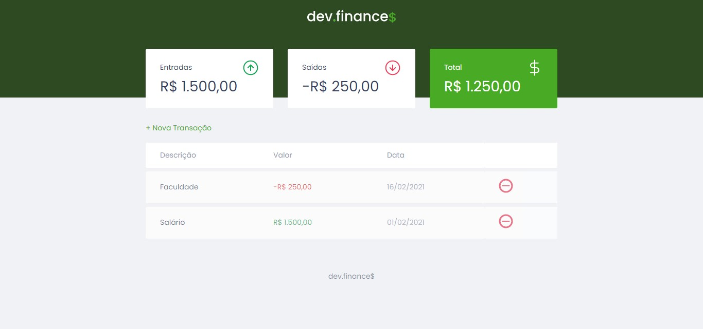
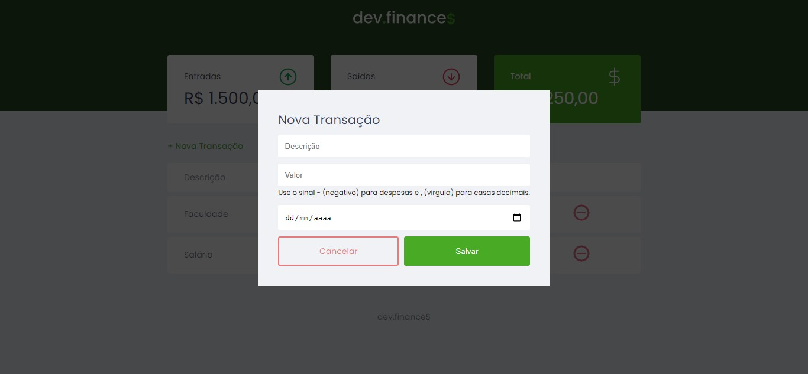
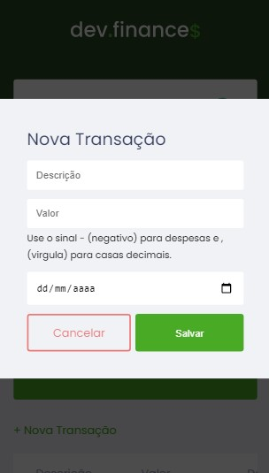
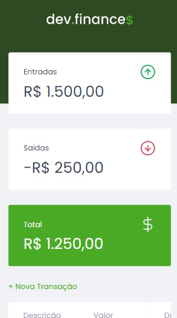

# dev.finance💲
Um projeto Rocketseat chamado Discover e a intenção era entre outras praticar HTML, CSS e JS, além de apresentar as linguagens para futuros programadores. Na minha proposta eu adicionei algumas modificações básicas para concorrer a um sorteio do curso Ignite na mesma plataforma. 

## Objetivo
O app administra os gastos e os ganhos de alguem, guarda um hitorico de ganhos e gastos no proprio navegador por cookies e mostra de forma didática o total gasto, total ganho e o total restante.

## Skills

&nbsp;
&nbsp;
&nbsp;
&nbsp;
&nbsp;

## Example

### Desktop
  
  
  
### Mobile
  
  

